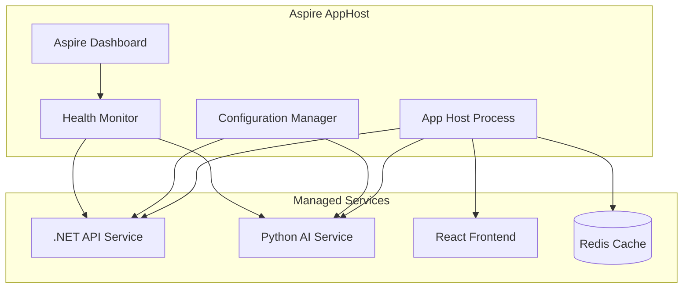

# UltimateApp Technology Stack

## 🔧 Required Command Line Tools

### Core Development Tools
```bash
# .NET Development Platform
dotnet --version          # >= 9.0 - .NET SDK for API services and Aspire orchestration
aspire --version          # Latest - .NET Aspire CLI for distributed app management

# Python & Package Management  
python --version          # >= 3.12 - Python runtime for AI services
uv --version              # Latest - Ultra-fast Python package manager and resolver

# Frontend Development
npm --version             # >= 18.0 - Node.js package manager
node --version            # >= 18.18.0 - JavaScript runtime for React development

# Containerization & Orchestration
docker --version          # Latest - Container runtime for local development
dapr --version            # >= 1.15 - Distributed Application Runtime CLI

# Optional Development Tools
redis-cli --version       # Latest - Redis client for cache management
curl --version            # Latest - HTTP client for API testing
```

### Installation Commands
```bash
# Install .NET Aspire workload
dotnet workload install aspire

# Install Dapr CLI and runtime
dapr init

# Install UV for Python package management
curl -LsSf https://astral.sh/uv/install.sh | sh

# Verify MCP server tools (docs-mcp-server)
npx @modelcontextprotocol/inspector --version
```

## 🏗️ Technology Stack Overview

### **Frontend Layer**
| Technology | Purpose | CLI Command |
|------------|---------|-------------|
| **React 19** | Modern UI framework with concurrent features | `npm create vite@latest` |
| **Vite** | Lightning-fast build tool and dev server | `npm run dev` |
| **Assistant-UI** | AI chat components for conversational interfaces | `npm install @assistant-ui/react` |
| **TypeScript** | Type-safe JavaScript development | `tsc --version` |

### **Backend Services**
| Technology | Purpose | CLI Command |
|------------|---------|-------------|
| **ASP.NET Core** | High-performance web API framework | `dotnet new webapi` |
| **FastAPI** | Modern Python API framework for AI services | `uv add fastapi uvicorn` |
| **MCP Server** | Model Context Protocol implementation | `uv add mcp` |
| **OpenAPI** | API documentation and specification | `dotnet add package Swashbuckle.AspNetCore` |

### **AI & Machine Learning**
| Technology | Purpose | CLI Command |
|------------|---------|-------------|
| **OpenAI SDK** | Large Language Model integration | `uv add openai` |
| **LangChain** | AI agent framework and orchestration | `uv add langchain` |
| **Anthropic Claude** | Advanced conversational AI | `uv add anthropic` |
| **Hugging Face** | Open-source ML model ecosystem | `uv add transformers` |

### **Distributed Runtime**
| Technology | Purpose | CLI Command |
|------------|---------|-------------|
| **Dapr Runtime** | Microservices communication patterns | `dapr run --app-id myapp` |
| **Dapr Actors** | Stateful compute units with turn-based concurrency | `dapr invoke --app-id actor-service` |
| **Dapr Workflow** | Long-running business process orchestration | `dapr workflow start` |
| **Dapr Pub/Sub** | Event-driven messaging and decoupling | `dapr publish --topic events` |

### **Data & State Management**
| Technology | Purpose | CLI Command |
|------------|---------|-------------|
| **Redis** | High-performance cache and session store | `redis-cli ping` |
| **Dapr State Store** | Distributed state management abstraction | `dapr state get --app-id myapp` |
| **SQLite** | Embedded database for development | `sqlite3 --version` |
| **PostgreSQL** | Production-grade relational database | `psql --version` |

### **Orchestration & DevOps**
| Technology | Purpose | CLI Command |
|------------|---------|-------------|
| **.NET Aspire** | Distributed application orchestration platform | `dotnet run --project AppHost` |
| **Docker** | Containerization for consistent environments | `docker compose up` |
| **Azure Container Apps** | Serverless container hosting platform | `az containerapp up` |
| **Kubernetes** | Container orchestration for production | `kubectl get pods` |

## 🎼 .NET Aspire Orchestration Concept

### **Unified Application Model**
.NET Aspire transforms distributed application development by providing a **single orchestration point** that manages:

```csharp
var builder = DistributedApplication.CreateBuilder(args);

// Define infrastructure dependencies
var cache = builder.AddRedis("cache");
var database = builder.AddPostgres("db");

// Add .NET services
var apiService = builder.AddProject<Projects.ApiService>("api")
    .WithReference(cache)
    .WithReference(database);

// Add Python AI services  
var aiService = builder.AddUvicornApp("ai", "../Python", "main:app")
    .WithReference(cache);

// Add React frontend
var frontend = builder.AddNpmApp("web", "../WebApp")
    .WithReference(apiService)
    .WithReference(aiService);

builder.Build().Run();
```

### **Core Orchestration Benefits**

#### **🔍 Service Discovery**
- **Automatic endpoint resolution** between services
- **Environment-specific configuration** (dev/staging/prod)
- **Type-safe service references** with compile-time validation
- **Health check integration** with automatic failover

#### **📊 Unified Observability**
- **Centralized logging** across all services and languages
- **Distributed tracing** with correlation IDs
- **Real-time metrics** collection and visualization
- **Health monitoring** with automated alerts

#### **⚙️ Configuration Management**
- **Environment variable injection** for service configuration
- **Secret management** with secure storage integration
- **Feature flag support** for gradual rollouts
- **Connection string management** across data stores

#### **🚀 Development Experience**
- **Hot reload** across the entire distributed stack
- **Integrated debugging** with cross-service breakpoints
- **Visual dashboard** for monitoring service health
- **One-command startup** for complex multi-service applications

### **Aspire AppHost Architecture**



## 📈 Observability with OTLP Standard

### **OpenTelemetry Protocol (OTLP) Integration**
UltimateApp leverages **industry-standard observability** through .NET Aspire's built-in OTLP support:

#### **Telemetry Collection**
```csharp
// Automatic instrumentation via Aspire Service Defaults
builder.AddServiceDefaults(); // Enables OTLP for all services
```

#### **Standard Telemetry Endpoints**
```bash
# Metrics endpoint
curl http://localhost:5000/metrics

# Health checks
curl http://localhost:5000/health

# Trace exports to OTLP collector
export OTEL_EXPORTER_OTLP_ENDPOINT="http://jaeger:14268/api/traces"
```

### **Observability Stack**
| Component | Purpose | Integration |
|-----------|---------|-------------|
| **OTLP Collector** | Telemetry data aggregation | Built into Aspire |
| **Jaeger** | Distributed tracing visualization | `docker run jaeger/all-in-one` |
| **Prometheus** | Metrics collection and storage | Aspire exports compatible format |
| **Grafana** | Observability dashboards | Connects to Aspire metrics |

### **Cross-Service Tracing**
- **Automatic trace propagation** across .NET, Python, and React services
- **W3C Trace Context** standard for correlation IDs
- **Baggage propagation** for contextual metadata
- **Activity Source integration** for custom instrumentation

### **Production Observability**
```yaml
# Azure Container Apps integration
observability:
  telemetry:
    otlp:
      endpoint: "https://your-collector.azure.com"
    logs:
      destination: "azure-monitor"
    metrics:
      destination: "prometheus"
```

## 🔄 Development Workflow

### **Local Development**
```bash
# 1. Start entire distributed application
dotnet run --project UltimateApp.AppHost

# 2. Access Aspire Dashboard
open https://localhost:15888

# 3. Monitor service health and logs in real-time
# 4. Make changes to any service - hot reload automatically applies
# 5. Debug across services with unified logging
```

### **Production Deployment**
```bash
# Deploy to Azure Container Apps
azd up

# Monitor production observability
az monitor app-insights query --analytics-query "traces | limit 100"
```

## 🌟 Integration Benefits

### **Polyglot Development**
- **Language-specific strengths** utilized optimally
- **Unified deployment** regardless of technology stack
- **Cross-language debugging** through shared observability
- **Consistent patterns** across different runtimes

### **AI-Native Architecture**
- **MCP protocol** for standardized AI agent communication
- **Real-time streaming** with WebSocket and Server-Sent Events
- **Context preservation** across conversation sessions
- **Multi-agent orchestration** with Dapr actors and workflows

### **Enterprise Readiness**
- **Production observability** with industry standards
- **Scalable architecture** with horizontal service scaling
- **Security by default** with mTLS and authentication
- **Compliance support** with audit logging and tracing
